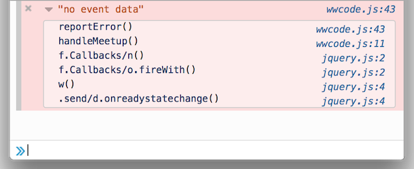
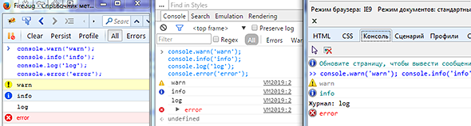
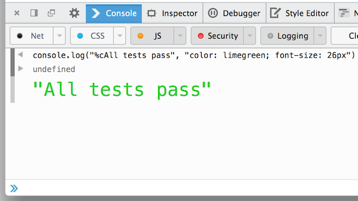
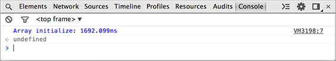
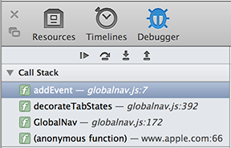
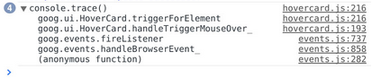
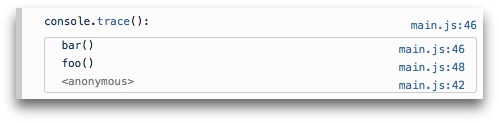

# jsConsoleApiReference
Javascript console api reference is page with functions of console object and descriptions of browser and platform support of its.

Localizations of page:

* [english](https://github.com/spmbt/jsConsoleApiReference) (this page)
* [russian](https://github.com/spmbt/jsConsoleApiReference/blob/master/jsConsoleApiReference-ru.md)

This Markdown Page does not display tooltips explaining some features of an application in browsers and environments. A full description is found [in HTML page](http://spmbt.github.io/jsConsoleApiReference/jsConsoleApiReference.htm), which, moreover, can minimize some or all of the descriptions.

#### Abbreviations

* -&#8861;- &mdash; method is not used in this environment;
* &plusmn; &mdash; method is used, but implemented with features or partially;
* `+` &mdash; full implementation.

### Description of the methods and the list of browsers and platforms support

<table class="jCAR"><tr>
	<th></th>

<th>

 Chrome
</th>
<th>

 Firebug
</th>
<th>

 Firefox
</th>
<th>

&nbsp;IE
</th>
<th>

 Node.js
</th>
<th>

 Safari
</th>
<th class="abbr">

 Opera
</th>
</tr><tr><td colspan="8"><dl><dt><b>assert(<i>expression[, object, ...]</i>)</b></dt><dd>If false, it displays <i>console.error</i>, else nothing.</dd></dl></td>
</tr><tr>
	<td></td>
	<td>&nbsp; +</td>
	<td>&nbsp; +</td>
	<td><a target="_blank" href="https://developer.mozilla.org/en-US/docs/Web/API/Console/assert">&nbsp; +</a> (28.0+)</td>
	<td><a target="_blank" href="https://msdn.microsoft.com/en-us/library/ie/hh772171%28v=vs.85%29.aspx">&nbsp; +</a></td>
	<td>&nbsp; +</td>
	<td>&nbsp; +</td>
	<td class="abbr">&nbsp; &plusmn;</td>
</tr><tr><td colspan="8"><dl><dt><b>clear()</b></dt><dd>Clears console window.</dd></dl></td>
</tr><tr>
	<td></td>
	<td>&nbsp; +</td>
	<td>&nbsp; +</td>
	<td>-&#8861;-</td>
	<td><a target="_blank" href="https://msdn.microsoft.com/en-us/library/ie/jj152131%28v=vs.85%29.aspx">&nbsp; +</a></td>
	<td>-&#8861;-</td>
	<td>&nbsp; +</td>
	<td>&nbsp; +</td>
</tr><tr><td colspan="8"><dl><dt><b>count(<i>[object]</i>)</b></dt><dd>It displays the number of passes of a given point code every time. If there is an argument <i>object</i>, it is displayed <i>object.toString() before the counter</i>.</dd></dl></td>
</tr><tr>
	<td></td>
	<td>&nbsp; +</td>
	<td>&nbsp; +</td>
	<td><a target="_blank" href="https://developer.mozilla.org/en-US/docs/Web/API/Console/count">&nbsp; +</a> (30.0+)</td>
	<td><a target="_blank" href="https://msdn.microsoft.com/en-us/library/ie/dn265064%28v=vs.85%29.aspx">&nbsp; +</a></td>
	<td>-&#8861;-</td>
	<td>&nbsp; +</td>
	<td class="abbr">&plusmn; ...</td>
</tr><tr><td colspan="8"><dl><dt><b>debug(<i>object[, object, ...]</i>)</b></dt><dd>The equivalent of <i>console.log</i> for compatibility with the old version of the object <i>console</i>, where <i>.debug</i> shows additonal link on the line of code, from which method was called.</dd></dl></td>
</tr><tr>
	<td>
<i>&nbsp;&nbsp;&nbsp;equals .log()</i>
</td>
	<td>&nbsp; +</td>
	<td>&nbsp; +</td>
	<td>&nbsp; +</td>
	<td><a target="_blank" href="https://msdn.microsoft.com/en-us/library/ie/dn265066%28v=vs.85%29.aspx">&nbsp; +</a></td>
	<td>-&#8861;-</td>
	<td>&nbsp; +</td>
	<td class="abbr">&plusmn; ...</td>
</tr><tr><td colspan="8"><dl><dt><b>dir(<i>object</i>)</b></dt><dd><i>object</i> it appears as a Javascript-object (for DOM-elements shows all of its attributes and methods). <b>%O</b> works in <i>console.log</i> in Chrome similarly.</dd></dl></td>
</tr><tr>
	<td></td>
	<td>&nbsp; +</td>
	<td>&nbsp; +</td>
	<td><a target="_blank" href="https://developer.mozilla.org/en-US/docs/Web/API/Console/dir">&nbsp; +</a> (8+)</td>
	<td><a target="_blank" href="https://msdn.microsoft.com/en-us/library/ie/jj152132%28v=vs.85%29.aspx">&nbsp; +</a> (9+)</td>
	<td>&nbsp; +</td>
	<td>&nbsp; +</td>
	<td class="abbr">&nbsp; +</td>
</tr><tr><td colspan="8"><dl><dt><b>dirxml(<i>object</i>)</b></dt><dd>Outputs XML code of object.</dd></dl></td>
</tr><tr>
	<td></td>
	<td>&nbsp; +</td>
	<td>&nbsp; +</td>
	<td>-&#8861;-</td>
	<td><a target="_blank" href="https://msdn.microsoft.com/en-us/library/ie/dn265067%28v=vs.85%29.aspx">&nbsp; +</a> (11+)</td>
	<td>-&#8861;-</td>
	<td>&nbsp; +</td>
	<td class="abbr">&plusmn; ...</td>
</tr><tr><td colspan="8"><dl><dt><b>error(<i>object[, object, ...]</i>)</b></dt><dd>Sends an error message to the console and <i>console.trace</i> for the position from which it was called (without stopping the execution of the program). Patterns are supports (<b>%s</b>, <b>%d</b> (<b>%i</b>), <b>%f</b>, <b>%o</b>, <b>%O</b>, <b>%c</b>), as in <i>console.log</i>. Example of tracing the call stack (Firefox 31+): 
	</dd></dl></td>
</tr><tr>
	<td></td>
	<td>&nbsp; +</td>
	<td class="abbr">&plusmn; ...</td>
	<td class="abbr">&nbsp; +</td>
	<td><a target="_blank" href="https://msdn.microsoft.com/en-us/library/ie/hh772176%28v=vs.85%29.aspx">&nbsp; +</a> (8+)</td>
	<td>&nbsp; +</td>
	<td>&nbsp; +</td>
	<td class="abbr">&plusmn; ...</td>
</tr><tr><td colspan="8"><dl><dt><b>exception(<i>object[, object, ...]</i>)</b></dt><dd>Equals to <i>.error()</i>.</dd></dl></td>
</tr><tr>
	<td>
<i>&nbsp;&nbsp;equal .error()</i>
</td>
	<td>-&#8861;-</td>
	<td>-&#8861;-</td>
	<td><a target="_blank" href="https://developer.mozilla.org/en-US/docs/Web/API/Console/error">&nbsp; +</a> (28+)</td>
	<td>-&#8861;-&nbsp;&nbsp;&nbsp;&nbsp;&nbsp;&nbsp;&nbsp;</td>
	<td>-&#8861;-</td>
	<td>-&#8861;-</td>
	<td>-&#8861;-</td>
</tr><tr><td colspan="8"><dl><dt><b>group(<i>object[, object, ...]</i>)</b></dt><dd>Starts Expanded group logs in the console, which can then be roll up manually. Group terminates the command <i>.groupEnd ()</i>. Patterns are supported (see <i>.log()</i>). Sample code and output (from the article «<a target="_blank" href="http://stepansuvorov.com/blog/2013/04/%D0%B2%D0%BE%D0%B7%D0%BC%D0%BE%D0%B6%D0%BD%D0%BE%D1%81%D1%82%D0%B8-%D0%BA%D0%BE%D0%BD%D1%81%D0%BE%D0%BB%D0%B8-%D0%B1%D1%80%D0%B0%D1%83%D0%B7%D0%B5%D1%80%D0%B0/">Browser console opportunities</a> (ru)», 2013): 
	<i class="gray">(javascript)</i> 
	

<pre>
	console.group("module A")
	console.log('a')
	console.log('a')
	console.log('a')
	console.group("nested module B")
	console.log('b')
	console.log('b')
	console.log('b')
	console.groupEnd()
	console.groupCollapsed("nested collapsed module C")
	console.log('c')
	console.log('c')
	console.log('c')
	console.groupEnd()
	console.groupEnd()
	console.group("module D")
	console.log('d')
	console.log('d')
	console.log('d')
	console.groupEnd()
</pre>

	 

	</dd></dl></td>
</tr><tr>
	<td></td>
	<td>&nbsp; +</td>
	<td>&nbsp; +</td>
	<td class="abbr">&plusmn; ...</td>
	<td><a target="_blank" href="https://msdn.microsoft.com/en-us/library/ie/dn265068%28v=vs.85%29.aspx">&nbsp; +</a> (11+)</td>
	<td>-&#8861;-</td>
	<td>+ (4+)</td>
	<td>&nbsp; +</td>
</tr><tr><td colspan="8"><dl><dt><b>groupCollapsed(<i>object[, object, ...]</i>)</b></dt><dd>Starts collapsed group of log in the console, which can then unfold manually. Group terminates by command <i>.groupEnd()</i>. Patterns are supported (see <i>.log()</i>).</dd></dl></td>
</tr><tr>
	<td></td>
	<td>&nbsp; +</td>
	<td>&nbsp; +</td>
	<td class="abbr">&plusmn; ... (9+)</td>
	<td><a target="_blank" href="https://msdn.microsoft.com/en-us/library/ie/dn265069%28v=vs.85%29.aspx">&nbsp; +</a> (11+)</td>
	<td>-&#8861;-</td>
	<td>+ (5.1+)</td>
	<td>&nbsp; +</td>
</tr><tr><td colspan="8"><dl><dt><b>groupEnd()</b></dt><dd>Indicates the end of the group of log messages that can fold or unfold (except Firefox) manually.</dd></dl></td>
</tr><tr>
	<td></td>
	<td>&nbsp; +</td>
	<td><a target="_blank" href="https://getfirebug.com/wiki/index.php/Console.groupEnd">&nbsp; +</a></td>
	<td><a target="_blank" href="https://developer.mozilla.org/en-US/docs/Web/API/Console/groupEnd">&nbsp; +</a> (9+)</td>
	<td><a target="_blank" href="https://msdn.microsoft.com/en-us/library/ie/dn265070%28v=vs.85%29.aspx">&nbsp; +</a> (11+)</td>
	<td>-&#8861;-</td>
	<td>+ (4+)</td>
	<td>&nbsp; +</td>
</tr><tr>
	<th></th>
	<th>

 Chrome
</th>
	<th>

 Firebug
</th>
	<th>

 Firefox
</th>
	<th>

 IE
</th>
	<th>

 Node.js
</th>
	<th>

 Safari
</th>
	<th class="abbr">

 Opera
</th>
</tr><tr><td colspan="8"><dl><dt><b>info(<i>object[, object, ...]</i>)</b></dt><dd>The operation is similar to the <i>.log()</i>, but is made in a different design to distinguish the types of messages, for example, the importance of graduation or for other semantic meaning of this group of messages. Patterns are supported (described in <i>.log()</i>). An example of differences for Firebug, Chrome, IE9: 
	</dd></dl></td>
</tr><tr>
	<td></td>
	<td>&nbsp; +</td>
	<td>&nbsp; +</td>
	<td>&nbsp; +</td>
	<td>&nbsp; +</td>
	<td>&nbsp; +</td>
	<td>&nbsp; +</td>
	<td>&nbsp; +</td>
</tr><tr><td colspan="8"><dl><dt><b>log(<i>object[, object, ...]</i>)</b></dt><dd>Displays the arguments in the console, separated by spaces. The most popular command in <i>console</i>. 
	 
	It supports patterns, which are special names in the first argument, indicating that it should be to use as template, in which following arguments will be substituted instead variables of pattern (as in printf() in C, but it is much easier). Examples: 
	 
	<i class="gray">(javascript)</i> 
	

<pre>
  console.log('Peter had %d %s', 10,'apples');
  console.log('Pi is equal to %f', Math.PI);
  console.log('%cRichard %cOf %cYork%c Gave Battle In Vain',
      'color:red;','font-size:16px;color:orange;','background:black;color:yellow;',
      'font:normal;color:normal;background:normal;');
  console.log('body as DOM: %o',document.getElementsByTagName('body')[0]);
  console.log('object: %O',{a:1,b:2});
  console.log('body as Object: %O',document.getElementsByTagName('body')[0]);
</pre>

	 

	Types of patterns and data type to which it converts values: 
	<b>%s</b> &mdash; string. 
	<b>%d</b> or <b>%i</b> &mdash; number. 
	<b>%f</b> &mdash; float number (Firebug supports also). 
	<b>%o</b> &mdash; DOM-element (Firebug outputs as reference to element. Chrome, in addition to references, displays an item in the console. Firefox opens in a modal window by click (all attributes and methods of this object are available)). 
	<b>%O</b> &mdash; JS object (not supported in Firefox; Chrome converts DOM object to JS object for this pattern; Firebug does not distinguish <b>%o</b> and <b>%O</b>). 
	<b>%c</b> &mdash; CSS-style (color, background, font; in Firefox is supported from version 31). Example of stylization by pattern <b>%c</b> (Firefox): 
	</dd></dl></td>
</tr><tr>
	<td>
&nbsp; &nbsp;<i>(important)</i>
</td>
	<td>&nbsp; +</td>
	<td>&nbsp; +</td>
	<td>&nbsp; +</td>
	<td>&nbsp; +</td>
	<td>&nbsp; +</td>
	<td>&nbsp; +</td>
	<td class="abbr">&plusmn; ...</td>
</tr><tr><td colspan="8"><dl><dt><b>markTimeline()</b></dt><dd>Synonym of <i>.timeStamp()</i> for Safari, but <i>.timeStamp()</i> is not supported in it, and vice versa.</dd></dl></td>
</tr><tr>
	<td>
<i>&nbsp;=.timeStamp()</i>
</td>
	<td>-&#8861;-</td>
	<td>-&#8861;-</td>
	<td>-&#8861;-</td>
	<td>-&#8861;-</td>
	<td>-&#8861;-</td>
	<td>&nbsp; +</td>
	<td>-&#8861;-</td>
</tr><tr><td colspan="8"><dl><dt><b>profile(<i>[label]</i>)</b></dt><dd><a target="_blank" href="https://developer.chrome.com/devtools/docs/console-api#consoleprofile">Starts Javascript-profiler</a>, then shows results under name <i>label</i>.</dd></dl></td>
</tr><tr>
	<td></td>
	<td>&nbsp; +</td>
	<td>&nbsp; +</td>
	<td class="abbr">(devtools)</td>
	<td>+ (10+)</td>
	<td>-&#8861;-</td>
	<td>&nbsp; +</td>
	<td>-&#8861;-</td>
</tr><tr><td colspan="8"><dl><dt><b>profileEnd()</b></dt><dd>Turns off Javascript-profiler.</dd></dl></td>
</tr><tr>
	<td></td>
	<td>&nbsp; +</td>
	<td>&nbsp; +</td>
	<td class="abbr">(devtools)</td>
	<td>+ (10+)</td>
	<td>-&#8861;-</td>
	<td>&nbsp; +</td>
	<td>-&#8861;-</td>
</tr><tr><td colspan="8"><dl><dt><b>table(<i>data[, columns]</i>)</b></dt><dd>The two-dimensional tabular data presented in a tabular format. <i>Data</i> is array or object (or object of objects,  object of arrays), each element of which is a string in the table. The first column of a two-dimensional array will be its index (from 0). Or, if there is an object, the first column would consist of keys of the object. Example in Firefox (object of objects): 
	 
	<i>Columns</i> is optional array of names of columns for the table header, if the strings are built from arrays, and we do not want to have the names of numeric codes. Above was an example of the result (Firefox), either obtained from the named column or object of objects. Below we show that it would be from an array of arrays without parameter <i>columns</i>: 
	</dd></dl></td>
</tr><tr>
	<td></td>
	<td>&nbsp; +</td>
	<td><a target="_blank" href="http://www.softwareishard.com/blog/firebug/tabular-logs-in-firebug/">&nbsp; +</a></td>
	<td><a target="_blank" href="https://developer.mozilla.org/en-US/docs/Web/API/Console/table">&nbsp; +</a> (34.0+)</td>
	<td>-&#8861;-</td>
	<td>-&#8861;-</td>
	<td>-&#8861;-</td>
	<td>-&#8861;-</td>
</tr><tr><td colspan="8"><dl><dt><b>time(<i>label</i>)</b></dt><dd>Turns on milliseconds counter with name <i>label</i>.</dd></dl></td>
</tr><tr>
	<td></td>
	<td>&nbsp; +</td>
	<td><a target="_blank" href="https://getfirebug.com/wiki/index.php/Console.time">&nbsp; +</a></td>
	<td><a target="_blank" href="https://developer.mozilla.org/en-US/docs/Web/API/Console/time">&nbsp; +</a> (10+)</td>
	<td>+ (11+)</td>
	<td>&nbsp; +</td>
	<td>+ (4+)</td>
	<td class="abbr">&nbsp; &plusmn;</td>
</tr><tr><td colspan="8"><dl><dt><b>timeEnd(<i>label</i>)</b></dt><dd>Stops milliseconds counter with name <i>label</i> and outputs result. Example (Chrome): 
	</dd></dl></td>
</tr><tr>
	<td></td>
	<td>&nbsp; +</td>
	<td><a target="_blank" href="http://www.stoimen.com/blog/2010/02/02/firebugs-console-time-accuracy/">&nbsp; +</a></td>
	<td><a target="_blank" href="https://developer.mozilla.org/en-US/docs/Web/API/Console/timeEnd">&nbsp; +</a> (10+)</td>
	<td>+ (11+)</td>
	<td>&nbsp; +</td>
	<td>+ (4+)</td>
	<td class="abbr">&nbsp; &plusmn;</td>
</tr><tr><td colspan="8"><dl><dt><b>timeStamp(<i>[label]</i>)</b></dt><dd>Draws the timestamp on the chart timings script for monitor the dynamics of the behavior of the program. Example (Firebug): 
	</dd></dl></td>
</tr><tr>
	<td></td>
	<td>&nbsp; +</td>
	<td><a target="_blank" href="http://www.softwareishard.com/blog/firebug/firebug-1-8-console-timestamp/">&nbsp; +</a></td>
	<td>-&#8861;-</td>
	<td>-&#8861;-</td>
	<td>-&#8861;-</td>
	<td>-&#8861;-</td>
	<td class="abbr">-&#8861;-</td>
</tr><tr><td colspan="8"><dl><dt><b>trace()</b></dt><dd>Shows the stack trace of function at the moment of execution (the same that is normally displayed when you stop on the error points). The example in Safari (in sidebar), in Chrome (console): 
	  
	In Firefox: 
	</dd></dl></td>
</tr><tr>
	<td></td>
	<td>&nbsp; +</td>
	<td>&nbsp; +</td>
	<td><a target="_blank" href="https://developer.mozilla.org/en-US/docs/Web/API/Console/trace">&nbsp; +</a> (10+)</td>
	<td>+ (11+)</td>
	<td>&nbsp; +</td>
	<td>+ (7.0.1+)</td>
	<td class="abbr">&plusmn; ...</td>
</tr><tr><td colspan="8"><dl><dt><b>warn(<i>object[, object, ...]</i>)</b></dt><dd>Similar to <i>.log()</i> and <i>.info()</i>, but drawn in different design to distinguish the types of messages. Patterns are supported (described in <i>.log()</i>).</dd></dl></td>
</tr><tr>
	<td></td>
	<td>&nbsp; +</td>
	<td>&nbsp; +</td>
	<td>&nbsp; +</td>
	<td>&nbsp; +</td>
	<td>&nbsp; +</td>
	<td>&nbsp; +</td>
	<td>&nbsp; +</td>
</tr><tr><td colspan="8"><dl><dt><b>debugger;</b></dt><dd>This operator stops Javascript on the current line. It is equal to a breakpoint in the debug panel. Does not affect the running program except stopping.</dd></dl></td>
</tr><tr>
	<td><i>&nbsp;&nbsp;(operator)</i></td>
	<td>&nbsp; +</td>
	<td>&nbsp; +</td>
	<td>&nbsp; +</td>
	<td>&nbsp; +</td>
	<td>&nbsp; +</td>
	<td>&nbsp; +</td>
	<td>&nbsp; +</td>
</tr><tr><td colspan="8"><dl><dt><b>throw new Error(<i>'mesasge'</i>);</b></dt><dd>It stops Javascript on the current line, interrupting the execution. <i> (This operator is supported by all execution environments of Javascript.)</i></dd></dl></td>
</tr><tr>
	<th></th>
	<th>

 <a target="_blank" href="https://developer.chrome.com/devtools/docs/console-api">Chrome</a>
</th>
	<th>

 <a target="_blank" href="https://getfirebug.com/wiki/index.php/Console_API">Firebug</a>
</th>
	<th>

 <a target="_blank" href="https://developer.mozilla.org/en-US/docs/Web/API/Console">Firefox</a>
</th>
	<th>

 <a target="_blank" href="https://msdn.microsoft.com/en-us/library/ie/hh772169%28v=vs.85%29.aspx">IE</a>
</th>
	<th>

 <a target="_blank" href="https://nodejs.org/api/console.html">Node.js</a>
</th>
	<th>

 <a target="_blank" href="https://developer.apple.com/library/mac/documentation/AppleApplications/Conceptual/Safari_Developer_Guide/Console/Console.html#//apple_ref/doc/uid/TP40007874-CH6-SW3">Safari</a>
</th>
	<th class="abbr">

 <a target="_blank" href="http://www.opera.com/dragonfly/documentation/console/">Opera</a>
</th>
</tr></table>

## References and explorations of *console*

* 7 links in the last row of table above
* <a href="https://hacks.mozilla.org/2014/05/editable-box-model-multiple-selection-sublime-text-keys-much-more-firefox-developer-tools-episode-31/">... + much more – Firefox Developer Tools Episode 31</a> - console stack traces, styled console logs в Fx31.
* <a href="https://msdn.microsoft.com/library/gg589530">Using the F12 Tools Console to View Errors and Status</a> (MSDN)
* <a href="http://habrahabr.ru/post/114483/">Using the console to the full</a> (ru)
* <a href="http://habrahabr.ru/post/202394/">Javascript debugging with console.table()</a> (ru)
* <a href="http://habrahabr.ru/post/114483/">Using the console to the full</a> (ru)
* <a href="http://habrahabr.ru/post/202394/">Javascript debugging with console.table()</a> (ru)
* <a target="_blank" href="http://habrahabr.ru/post/188066/">FireBug* Console API</a> - describes an detail of implementation, seen in tests of browsers 2013 г (ru);
* <a target="_blank" href="http://habrahabr.ru/post/198372/">API of console in Javascript</a> (2013; ru).
* ...
